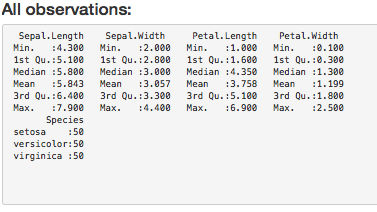
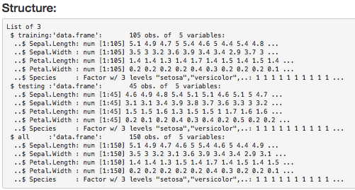
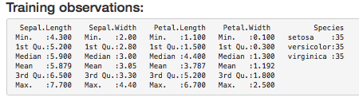
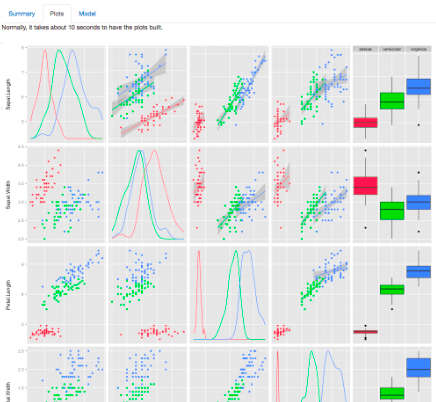
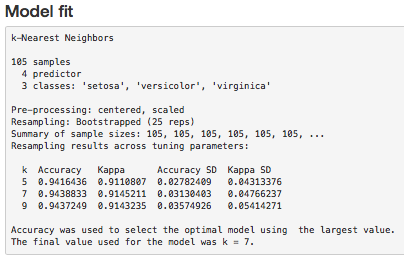
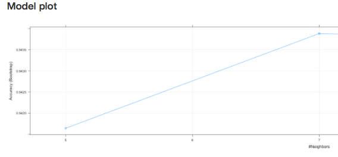
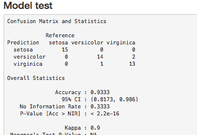

## Outline

1. Goal and features
2. Summary feature
3. Plots feature
4. Model features

## Goal and Features

The main goal of this application is to allow students to easily inspect the Iris dataset by providing built-in features such as dataset summary, plots and some machine learning models. That way, a student just starting learining this dataset can quickly take out information of it.

--- .class #id 

## Summary Feature

The summary tab shows some Iris statistics for all observations and for the observations used for training. The dataset structure is also presented.

---
## Plots Features
The plot tab shows a pair plot which confronts each variable with the remaining variables.

---
## Model features

The model feature tab shows information such as model fit, model plot and model test (confusion marix). By clicking on the radio buttons on the left side, a user can choose different models and compare which one better fit the iris dataset.

